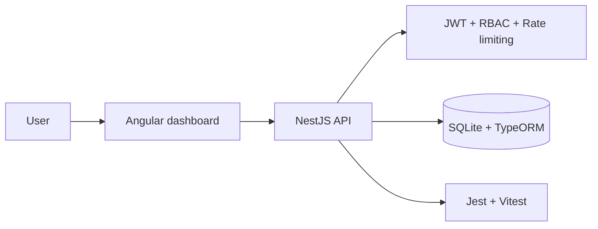

<div align="center">

**English** | [Português](README.pt-BR.md)

# FleetPulse

**Multitenant industrial fleet management with backend-enforced access control.**

</div>

A full-stack application for authentication and management of companies, users and industrial machines. It combines a responsive Angular dashboard, a NestJS API, SQLite persistence and JWT-based authorization.

## Architecture



The frontend uses the relative `/api` path. During development, Angular forwards requests to port `3000` through `proxy.conf.json`, avoiding machine-specific hostnames in the compiled application.

## Features

- JWT login, session expiration and safe authentication errors
- Dashboard with fleet totals, operational status, operating rate and average hours
- Machine CRUD with company ownership and unique serial numbers
- User CRUD with BCrypt-protected passwords and `ADMIN` / `USER` roles
- Company management for administrators
- Multitenant isolation enforced by the backend
- Responsive desktop, tablet and mobile layout
- Accessible labels, visible focus, alert regions and reduced-motion support

## Technology stack

| Layer | Technologies |
| --- | --- |
| Frontend | Angular 21, TypeScript, RxJS, Reactive Forms and native CSS |
| Backend | NestJS 11, TypeScript, Passport JWT and class-validator |
| Persistence | TypeORM and SQLite 6 |
| Security | Helmet, bcryptjs, JWT, restricted CORS and Throttler |
| Quality | Vitest, Angular Test, Jest, npm audit and Angular/Nest builds |

## Requirements

- Node.js `20.19` or newer, preferably Node 22 LTS
- npm `10` or newer
- Git

Node 24 is not recommended for this repository because the native `sqlite3` driver may fail during installation on some environments.

PostgreSQL, Docker and a separate SQLite installation are not required.

## Installation

```bash
git clone https://github.com/samuelhfdias-prog/Teste-momesso.git
cd Teste-momesso
npm run install:all
```

The command runs `npm ci` at the root, in `api` and in `Front-end`.

### Optional backend configuration

Development mode works without an `.env` file: it creates an in-memory random JWT key, initializes the local database and inserts demonstration data. To keep explicit settings between restarts:

PowerShell:

```powershell
Copy-Item api/.env.example api/.env
```

macOS or Linux:

```bash
cp api/.env.example api/.env
```

Review the file before using the application outside local development.

## Run in development

```bash
npm start
```

This starts:

- Dashboard: http://localhost:4200
- API: http://localhost:3000/api

The database is created automatically at `api/data/momesso.sqlite`.

### Demonstration accounts

Accounts are created only when `ENABLE_DEMO_SEED=true`, which is the default in development only.

| Role | Email | Local password |
| --- | --- | --- |
| Administrator | `admin@fleetpulse.dev` | `123456` |
| User | `operator@fleetpulse.dev` | `123456` |

Change `DEMO_ADMIN_PASSWORD` and `DEMO_USER_PASSWORD` or disable seeding. Default passwords must never be used in production.

## Environment variables

| Variable | Development default | Purpose |
| --- | --- | --- |
| `NODE_ENV` | `development` | `development`, `test` or `production` |
| `API_HOST` | `0.0.0.0` | Network interface used by the API |
| `API_PORT` | `3000` | API HTTP port |
| `CORS_ORIGIN` | `http://localhost:4200` | Comma-separated allowed origins |
| `DATABASE_PATH` | `data/momesso.sqlite` | Absolute path or path relative to `api` |
| `DATABASE_SYNCHRONIZE` | `true` outside production | TypeORM schema synchronization |
| `DATABASE_LOGGING` | `false` | Database query logging |
| `JWT_SECRET` | Random in development | JWT secret; at least 32 characters in production |
| `JWT_EXPIRATION` | `3600` | Token lifetime in seconds |
| `ENABLE_DEMO_SEED` | `true` in development | Creates demonstration data |
| `DEMO_ADMIN_PASSWORD` | `123456` | Demonstration administrator password |
| `DEMO_USER_PASSWORD` | `123456` | Demonstration user password |

## Access control

| Operation | ADMIN | USER |
| --- | :---: | :---: |
| View machines | All | Own company only |
| Create, update or delete machines | All | Own company only |
| View users | All | Own company only |
| Create users | Any company and role | Own company, always USER |
| Update users | Any user | Own profile, without changing role |
| Delete users | Yes, except own account | No |
| View or update companies | All | Own company only |
| Create or delete companies | Yes | No |

These rules are enforced on the server regardless of which controls are visible in the interface.

## API overview

All routes use the `/api` prefix.

| Method | Route | Authentication | Purpose |
| --- | --- | --- | --- |
| `POST` | `/api/auth/login` | Public | Authenticate and obtain a JWT |
| `POST` | `/api/auth/health` | Public | Check API availability |
| `GET/POST` | `/api/machines` | Bearer JWT | List or create machines |
| `GET/PATCH/DELETE` | `/api/machines/:id` | Bearer JWT | Read, update or delete a machine |
| `GET` | `/api/machines/statistics` | Bearer JWT | Dashboard indicators |
| `GET` | `/api/machines/company/:companyId` | Bearer JWT | Machines by company |
| `GET/POST` | `/api/users` | Bearer JWT | List or create users |
| `GET/PATCH/DELETE` | `/api/users/:id` | Bearer JWT | Read, update or delete a user |
| `GET/POST` | `/api/companies` | Bearer JWT | List or create companies |
| `GET/PATCH/DELETE` | `/api/companies/:id` | Bearer JWT | Read, update or delete a company |

Login example:

```bash
curl -X POST http://localhost:3000/api/auth/login \
  -H "Content-Type: application/json" \
  -d '{"email":"admin@fleetpulse.dev","password":"123456"}'
```

## Security highlights

- No fixed JWT secret in source code; production refuses short secrets
- Tokens stored in `sessionStorage`, checked for expiration and sent only to the API
- BCrypt password hashing with 12 rounds
- Password hashes excluded from common TypeORM queries and HTTP serialization
- Global limit of 120 requests per minute and five login attempts per minute
- Helmet and removal of `X-Powered-By`
- CORS allowlist without wildcard origins or cross-origin credentials
- 100 KB limit for JSON and URL-encoded bodies
- DTO whitelist, rejection of extra fields and input normalization
- Backend protection against privilege escalation and cross-tenant access
- Dependency verification through `npm audit`

Production deployments should also use HTTPS, configure proxy security headers, keep `DATABASE_SYNCHRONIZE=false`, disable demonstration data and back up the database.

## Scripts

| Command | Action |
| --- | --- |
| `npm start` | Start API and frontend in development |
| `npm run install:all` | Install all lockfiles through `npm ci` |
| `npm run build` | Build backend and frontend |
| `npm test` | Run Jest and Vitest without watch mode |
| `npm run audit:prod` | Audit production dependencies |
| `npm --prefix api run lint` | Run TypeScript checks without emitting files |

## Build and production

```bash
npm run build
```

Generated artifacts:

- API: `api/dist`
- Dashboard: `Front-end/dist/fleetpulse/browser`

Start only the compiled API:

```bash
npm --prefix api run start:prod
```

Serve the Angular files through Nginx, Apache, IIS or an equivalent service. Forward `/api` to NestJS and redirect unknown frontend routes to `index.html`.

## Tests and audit

```bash
npm test
npm run build
npm run audit:prod
npm --prefix api audit
npm --prefix Front-end audit
```

Backend tests cover environment validation and critical authorization rules. Angular tests validate application and primary-component creation.

## Project structure

```text
FleetPulse/
|-- api/
|   |-- src/common/           # guards and decorators
|   |-- src/modules/          # auth, companies, machines and users
|   |-- src/environment.config.ts
|   `-- data/                 # ignored local database
|-- Front-end/
|   |-- public/assets/
|   |-- src/app/components/
|   |-- src/app/services/
|   `-- proxy.conf.json
|-- package.json
`-- README.md
```

Never commit `.env` files, SQLite databases, tokens or real credentials. Matching patterns are included in `.gitignore`.
