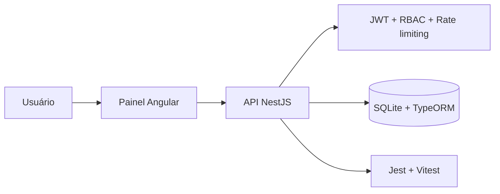

<div align="center">

[English](README.md) | **Português**

</div>

# Momesso Fleet Control

Aplicação full-stack para autenticação e gerenciamento multitenant de empresas, usuários e máquinas industriais. O projeto combina um painel Angular responsivo com uma API NestJS, persistência local em SQLite e controle de acesso por JWT.

## Arquitetura em uma visão



## Visão geral

O sistema mantém o fluxo funcional original de login, dashboard e CRUDs, mas foi preparado para execução reproduzível em Windows, macOS e Linux. O front-end acessa a API por uma URL relativa (`/api`), evitando dependência do hostname do computador. Em desenvolvimento, o Angular encaminha essas chamadas para a porta `3000` por meio de `proxy.conf.json`.

```text
Navegador
   │
   ├── Angular 21 (porta 4200 em desenvolvimento)
   │       └── /api → proxy local
   │
   └── NestJS 11 (porta 3000)
           ├── autenticação JWT e rate limiting
           ├── autorização ADMIN / USER
           ├── TypeORM
           └── SQLite em api/data/momesso.sqlite
```

## Funcionalidades

- Login com JWT, expiração de sessão e mensagens de erro seguras.
- Dashboard com total de máquinas, situação operacional, taxa de operação e média de horas.
- CRUD de máquinas com vínculo obrigatório a uma empresa e número de série único.
- CRUD de usuários com senha protegida por bcrypt e papéis `ADMIN` e `USER`.
- CRUD de empresas disponível a administradores.
- Isolamento multitenant: usuários comuns só consultam dados da própria empresa.
- Layout responsivo para desktop, notebook, tablet e celular.
- Interface acessível com rótulos, foco visível, regiões de alerta e suporte a redução de movimento.

## Tecnologias

| Camada | Tecnologias |
| --- | --- |
| Front-end | Angular 21, TypeScript, RxJS, Reactive Forms, CSS nativo |
| Back-end | NestJS 11, TypeScript, Passport JWT, class-validator |
| Persistência | TypeORM e SQLite 6 |
| Segurança | Helmet, bcryptjs, JWT, CORS restrito, Throttler |
| Qualidade | Vitest/Angular Test, Jest, npm audit, build Angular/Nest |

## Pré-requisitos

- Node.js `20.19` ou superior. Node 22 e 24 também são suportados.
- npm `10` ou superior.
- Git.

Não é necessário instalar PostgreSQL, Docker ou SQLite separadamente. O driver e o arquivo de banco são gerenciados pelo projeto.

## Instalação

```bash
git clone https://github.com/samuelhfdias-prog/Teste-momesso.git
cd Teste-momesso
npm run install:all
```

`install:all` executa `npm ci` na raiz, em `api` e em `Front-end`. Como os comandos usam `npm --prefix`, não dependem de `cd`, barras de diretório ou sintaxe exclusiva de um sistema operacional.

### Configuração opcional do back-end

O modo de desenvolvimento funciona sem arquivo `.env`: uma chave JWT aleatória é criada em memória, o banco local é inicializado e os dados de demonstração são inseridos. Para manter configurações explícitas entre reinícios, copie o exemplo:

Windows PowerShell:

```powershell
Copy-Item api/.env.example api/.env
```

macOS/Linux:

```bash
cp api/.env.example api/.env
```

Edite `api/.env` antes de usar fora do ambiente local.

## Execução em desenvolvimento

```bash
npm start
```

Esse comando inicia simultaneamente:

- painel: `http://localhost:4200`;
- API: `http://localhost:3000/api`.

O banco é criado automaticamente em `api/data/momesso.sqlite`. O diretório é resolvido a partir da pasta da API, portanto iniciar o projeto pela raiz ou diretamente por `api` produz o mesmo resultado.

### Contas de demonstração

As contas só são criadas quando `ENABLE_DEMO_SEED=true` (padrão apenas em desenvolvimento).

| Perfil | E-mail | Senha local padrão |
| --- | --- | --- |
| Administrador | `suporte@momesso.ind.br` | `123456` |
| Usuário | `gerente@agroforte.com.br` | `123456` |

Altere `DEMO_ADMIN_PASSWORD` e `DEMO_USER_PASSWORD` no `.env` ou desative o seed. A senha padrão nunca deve ser usada em produção.

## Variáveis de ambiente

| Variável | Padrão em desenvolvimento | Descrição |
| --- | --- | --- |
| `NODE_ENV` | `development` | `development`, `test` ou `production` |
| `API_HOST` | `0.0.0.0` | Interface de rede em que a API escuta |
| `API_PORT` | `3000` | Porta HTTP da API |
| `CORS_ORIGIN` | `http://localhost:4200` | Origens permitidas, separadas por vírgula |
| `DATABASE_PATH` | `data/momesso.sqlite` | Caminho absoluto ou relativo à pasta `api` |
| `DATABASE_SYNCHRONIZE` | `true` fora de produção | Sincronização automática do schema pelo TypeORM |
| `DATABASE_LOGGING` | `false` | Log de consultas do banco |
| `JWT_SECRET` | aleatório em desenvolvimento | Segredo JWT; mínimo de 32 caracteres em produção |
| `JWT_EXPIRATION` | `3600` | Validade do token em segundos; mínimo de 60 |
| `ENABLE_DEMO_SEED` | `true` em desenvolvimento | Cria empresa e usuários de demonstração |
| `DEMO_ADMIN_PASSWORD` | `123456` | Senha do admin de demonstração |
| `DEMO_USER_PASSWORD` | `123456` | Senha do usuário de demonstração |

## Controle de acesso

| Operação | ADMIN | USER |
| --- | :---: | :---: |
| Consultar máquinas | Todas | Somente da própria empresa |
| Criar/editar/excluir máquinas | Todas | Somente da própria empresa |
| Consultar usuários | Todos | Somente da própria empresa |
| Criar usuário | Qualquer empresa/papel | Própria empresa, sempre como USER |
| Editar usuário | Qualquer usuário | Somente o próprio perfil, sem alterar papel |
| Excluir usuário | Sim, exceto a própria conta | Não |
| Consultar/editar empresa | Todas | Somente a própria empresa |
| Criar/excluir empresa | Sim | Não |

O servidor aplica essas regras independentemente do que estiver visível na interface. Alterar o HTML ou chamar a API manualmente não contorna a autorização.

## API

Todas as rotas usam o prefixo `/api`.

| Método | Rota | Autenticação | Finalidade |
| --- | --- | --- | --- |
| `POST` | `/api/auth/login` | Pública | Autenticar e obter JWT |
| `POST` | `/api/auth/health` | Pública | Verificar disponibilidade |
| `GET/POST` | `/api/machines` | Bearer JWT | Listar/criar máquinas |
| `GET/PATCH/DELETE` | `/api/machines/:id` | Bearer JWT | Consultar/alterar/excluir máquina |
| `GET` | `/api/machines/statistics` | Bearer JWT | Indicadores do dashboard |
| `GET` | `/api/machines/company/:companyId` | Bearer JWT | Máquinas por empresa |
| `GET/POST` | `/api/users` | Bearer JWT | Listar/criar usuários |
| `GET/PATCH/DELETE` | `/api/users/:id` | Bearer JWT | Consultar/alterar/excluir usuário |
| `GET/POST` | `/api/companies` | Bearer JWT | Listar/criar empresas |
| `GET/PATCH/DELETE` | `/api/companies/:id` | Bearer JWT | Consultar/alterar/excluir empresa |

Exemplo de login:

```bash
curl -X POST http://localhost:3000/api/auth/login \
  -H "Content-Type: application/json" \
  -d '{"email":"suporte@momesso.ind.br","password":"123456"}'
```

## Segurança implementada

- JWT sem segredo fixo no código; produção falha ao iniciar se o segredo tiver menos de 32 caracteres.
- Token armazenado em `sessionStorage`, validado por expiração e enviado apenas para URLs da própria API.
- Senhas com bcrypt (12 rounds), tamanho validado e nunca retornadas pela API.
- `passwordHash` excluído tanto das consultas comuns do TypeORM quanto da serialização HTTP.
- Rate limit global de 120 requisições/minuto e limite de 5 tentativas/minuto no login.
- Helmet e remoção do cabeçalho `X-Powered-By`.
- CORS com allowlist, sem origem curinga e sem credenciais cross-origin.
- Limite de 100 KB para corpos JSON e URL-encoded.
- DTOs com whitelist, rejeição de campos extras, comprimentos máximos, enums, UUIDs e normalização de entrada.
- Proteção contra escalação de privilégios e acesso entre tenants no back-end.
- Dependências de produção e desenvolvimento verificadas por `npm audit`.

Para produção, também use HTTPS no proxy reverso, configure cabeçalhos de segurança no servidor que entrega o Angular, mantenha `DATABASE_SYNCHRONIZE=false`, desative o seed e faça backup do banco.

## Scripts

| Comando | Ação |
| --- | --- |
| `npm start` | Inicia API e front-end em desenvolvimento |
| `npm run install:all` | Instala os três lockfiles com `npm ci` |
| `npm run build` | Compila back-end e front-end |
| `npm test` | Executa Jest e Vitest sem modo watch |
| `npm run audit:prod` | Audita somente dependências de produção |
| `npm --prefix api run lint` | Executa verificação TypeScript sem emitir arquivos |

## Build e produção

```bash
npm run build
```

Artefatos gerados:

- API: `api/dist`;
- painel: `Front-end/dist/teste_momesso/browser`.

Para iniciar somente a API compilada:

```bash
npm --prefix api run start:prod
```

Sirva os arquivos do Angular com Nginx, Apache, IIS ou serviço equivalente. Encaminhe `/api` para a API NestJS e redirecione rotas desconhecidas do front-end para `index.html`. Isso preserva a URL relativa e evita recompilar o painel para cada hostname.

## Testes e auditoria

```bash
npm test
npm run build
npm run audit:prod
npm --prefix api audit
npm --prefix Front-end audit
```

Os testes do back-end cobrem validação de ambiente e regras críticas de autorização. Os testes Angular validam a criação da aplicação e de todos os componentes principais.

## Solução de problemas

### Porta 3000 ou 4200 ocupada

Altere `API_PORT` e o alvo de `Front-end/proxy.conf.json`, ou encerre o processo que utiliza a porta.

Windows PowerShell:

```powershell
Get-NetTCPConnection -LocalPort 3000,4200 -ErrorAction SilentlyContinue |
  Select-Object LocalPort, OwningProcess
```

macOS/Linux:

```bash
lsof -i :3000 -i :4200
```

### Erro ao carregar a API no painel

Confirme que os dois processos exibidos pelo `npm start` estão ativos. Em desenvolvimento, o navegador deve chamar `/api`; não altere os serviços Angular para um IP fixo.

### Reiniciar dados locais

Pare a API e remova `api/data/momesso.sqlite`. O arquivo será recriado no próximo início em desenvolvimento. Essa ação apaga todos os dados locais.

### Erro de JWT em produção

Defina `JWT_SECRET` com ao menos 32 caracteres aleatórios. Não reutilize o valor de `.env.example`.

## Estrutura

```text
Teste-momesso/
├── api/
│   ├── src/common/           # guardas e decorators
│   ├── src/modules/          # auth, companies, machines e users
│   ├── src/environment.config.ts
│   └── data/                 # banco local ignorado pelo Git
├── Front-end/
│   ├── public/assets/        # identidade visual local
│   ├── src/app/components/   # login, dashboard e CRUDs
│   ├── src/app/services/     # autenticação e clientes HTTP
│   └── proxy.conf.json
├── package.json              # orquestração multiplataforma
└── README.md
```

Nunca versione `.env`, bancos SQLite, tokens ou credenciais reais. Os padrões correspondentes já estão incluídos no `.gitignore`.
